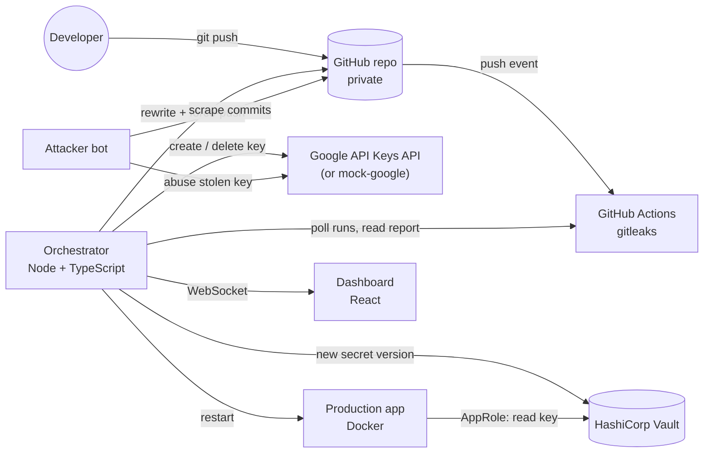

# LeakGuard

**README** · [Technical deep dive](TECHNICAL.md)

**Leaked-secret incident response on autopilot.** When a developer pushes an API key to GitHub,
deleting it does not help: bots copy new commits within seconds, the key stays in git history, and
the key itself keeps working. LeakGuard detects the leak, **rotates** the key, **redeploys**
production on the new key, **revokes** the leaked one, **scrubs git history**, **re-verifies**, and
finally produces a **zero-knowledge proof** that the private repository is clean. A live dashboard
explains each step as it happens.

> For the full explanation (why this problem matters, every component, the exact sequence of events,
> and how the zero-knowledge proof works and is calculated), read **[TECHNICAL.md](TECHNICAL.md)**.

---

## What happens in one run

| # | Stage | Tool | What happens |
|---|---|---|---|
| 1 | Leak | git | An "intern" pushes the production Gemini key in `config/production.env`. |
| 2 | Detect | GitHub Actions + gitleaks | The push is scanned across the full history; the job fails and uploads a report. |
| 3 | Rotate | Google API Keys API + HashiCorp Vault | A new key is minted and stored as a new Vault version. |
| 4 | Redeploy | Docker | The app restarts and reads the new key from Vault via AppRole. |
| 5 | Revoke | Google API Keys API | The leaked key is deleted. The attacker's calls start failing. |
| 6 | Clean history | git filter-repo | The key is replaced in every commit, then force-pushed. |
| 7 | Verify | gitleaks + GitHub Actions | The rewritten history is scanned locally and in CI: zero findings. |
| 8 | Prove | Circom + snarkjs (Groth16) | A ZK proof shows the repo is clean without revealing it. Verifiable in the browser. |

Leak to dead key: about 20 to 30 seconds. Leak to proof: about 40 seconds (most of it is GitHub
starting a runner). Production has zero downtime because the new key is deployed before the old one
is revoked.

## Architecture



Everything except GitHub runs locally from one `docker compose up`:

| Container | Port | Purpose |
|---|---|---|
| `dashboard` | 8080 | The live mission-control view |
| `orchestrator` | 4000 | Detection, rotation, redeploy, history rewrite, proofs |
| `vault` | 8200 | HashiCorp Vault (dev mode), holds the production key |
| `demo-app` | 3000 | "Gemini Fortune Teller", the production app being protected |
| `mock-google` | 7000 | Same REST API as Google's API Keys API v2 and Gemini |
| `attacker` | none | Bot that harvests keys from new commits and abuses them |

The architecture, design decisions and the zero-knowledge proof are explained in depth in
[TECHNICAL.md](TECHNICAL.md).

---

## Running it locally

### 1. Prerequisites

| Tool | Version | Check with |
|---|---|---|
| Docker Desktop (or Docker Engine) with Compose v2, Linux containers | 24+ | `docker compose version` |
| Node.js | 18+ | `node -v` |
| Git | 2.30+ | `git --version` |
| GitHub CLI | 2.x | `gh --version` |
| An SSH key added to your GitHub account | | `ssh -T git@github.com` |

Docker must be running before you continue. On Windows and macOS, start Docker Desktop and wait until
it reports that the engine is running.

### 2. Log in to GitHub

```bash
gh auth login        # GitHub.com, choose SSH as the git protocol, log in with the browser
gh auth status       # must show the 'repo' scope
ssh -T git@github.com   # must greet you by username
```

LeakGuard uses your `gh` token (with the `repo` scope) to create a private demo repository, read
Actions runs and push rewritten history. Workflow files are pushed once over SSH during setup,
because pushing them over HTTPS would need the extra `workflow` scope.

### 3. Get the code

```bash
git clone git@github.com:Percobain/leakguard.git
cd leakguard
```

### 4. Run the one-time setup

```bash
npm run setup
```

This script (`scripts/setup.mjs`):

1. reads your GitHub username and token from `gh`;
2. creates a **private** repository `<your-user>/leakguard-demo-target` if it does not exist;
3. pushes the template from `target-template/` (a tiny app plus the gitleaks workflow) and tags it
   `baseline`, which is what *Reset* restores later;
4. writes `.env` with your token, the target repo, the Vault token and a random AppRole secret ID.

Options:

- `TARGET_REPO_NAME=my-demo npm run setup` uses a different repository name.
- `npm run setup -- --force` re-pushes the template over an existing demo repository.

`.env` contains your GitHub token. It is git-ignored; never commit it.

### 5. Start the stack

```bash
docker compose up --build -d
```

The first build downloads base images, git, gitleaks and npm packages, and takes a few minutes. Then
wait for the orchestrator to finish bootstrapping:

```bash
docker compose logs -f orchestrator
```

You should see, in order:

```
[vault] AppRole "demo-app" ready with read-only policy gemini-read
[google] No valid production key in Vault, provisioning one via the API Keys API
[vault] Stored production key AIza...xxxx at secret/leakguard/gemini
[github] Tracking 1 commits on <you>/leakguard-demo-target
[leakguard] Ready. Waiting for pushes...
```

Press `Ctrl+C` to stop following the logs (the containers keep running).

### 6. Open the dashboard and run the demo

Open **http://localhost:8080**.

1. Press **Leak a key**. The exposure clock starts and chapter 01 lights up.
2. Within seconds the attacker panel shows the bot using the stolen key.
3. Watch chapters 02 to 08 complete on their own. The stage always shows the current chapter.
4. While the key is still in the repo, **Try proving clean** fails: a false statement cannot be proven.
5. At the end, click **Verify in my browser** to check the proof locally, or download `proof.json`.
6. Click any finished chapter on the left to replay it.
7. Press **Reset** to restore the demo repo to `baseline` before the next run.

Other useful URLs:

| URL | What |
|---|---|
| http://localhost:3000 | The production app, showing which key version it is using |
| http://localhost:8200 | Vault UI (token from `VAULT_TOKEN` in `.env`, default `leakguard-root`), see `secret/leakguard/gemini` |
| http://localhost:4000/api/state | The raw state the dashboard renders |
| `https://github.com/<you>/leakguard-demo-target/actions` | The gitleaks runs |

### 7. Stop

```bash
docker compose down        # stop everything
docker compose down -v     # stop and also delete the orchestrator's working clone
```

Vault runs in dev mode (in memory), so after a restart it is empty and LeakGuard provisions a fresh
production key automatically.

---

## Configuration (`.env`)

| Variable | Default | Meaning |
|---|---|---|
| `GITHUB_TOKEN` | from `gh auth token` | Token with `repo` scope |
| `TARGET_REPO` | `<you>/leakguard-demo-target` | Repository LeakGuard watches |
| `VAULT_TOKEN` | `leakguard-root` | Vault dev root token |
| `DEMO_APP_SECRET_ID` | random | AppRole secret ID used by the demo app |
| `GOOGLE_MODE` | `simulated` | `simulated` or `real` |
| `GCP_PROJECT` | `leakguard-demo` | Google Cloud project ID (real mode) |
| `DEMO_PACE_MS` | `3000` | Pause after each chapter so an audience can follow. `0` = full speed. The dashboard reports how much of the total was pacing. |

After changing `.env`, apply it with `docker compose up -d`.

## Using real Google / AI Studio keys

By default, `mock-google` simulates Google with the same endpoints. To rotate real Gemini keys:

1. In the Google Cloud project behind your AI Studio keys, enable the **API Keys API**.
2. Create a service account with the **API Keys Admin** role and download its JSON key.
3. Save it as `secrets/gcp-sa.json` (this folder is git-ignored).
4. In `.env`, set:
   ```
   GOOGLE_MODE=real
   GCP_PROJECT=<your-project-id>
   GEMINI_BASE=https://generativelanguage.googleapis.com
   ```
5. Run `docker compose up -d --build`.

Note that Google can take a minute or two to propagate a key deletion, so the attacker panel turns
green later than in simulated mode.

## Troubleshooting

| Symptom | Fix |
|---|---|
| `npm run setup` fails at `gh` | Run `gh auth login` and check `gh auth status`. |
| Setup fails pushing the template | Check `ssh -T git@github.com`. Add your SSH key to GitHub. |
| `docker compose up` says `run "npm run setup" first` | `.env` is missing. Run step 4. |
| A port is already in use | Stop whatever uses 8080, 4000, 3000, 7000 or 8200, or change the left side of `ports:` in `docker-compose.yml`. |
| Orchestrator log repeats `Bootstrap failed` | Read the message: usually an expired GitHub token (re-run `npm run setup`) or Vault still starting. |
| Detect stays on "Waiting for GitHub..." | Open the demo repo's Actions tab. Actions must be enabled, and private repos need available Actions minutes. |
| Redeploy fails | The orchestrator needs the Docker socket. Use Docker Desktop with Linux containers, or Docker Engine on Linux. |
| Dashboard shows "Orchestrator offline" | `docker compose ps` and `docker compose logs orchestrator`. |

## Development

```bash
# dashboard with hot reload, proxied to the orchestrator on :4000
cd dashboard && npm install && npm run dev

# dashboard against a scripted mock (no Docker needed)
cd dashboard && npm run mock     # in one terminal
cd dashboard && npm run dev      # in another

# orchestrator type-check
cd services/orchestrator && npm install && npx tsc --noEmit

# rebuild the ZK circuit and Groth16 keys (writes zk/build/)
cd zk && docker run --rm -v "$PWD":/zk -w /zk node:20-bookworm bash build.sh
```

CI (`.github/workflows/ci.yml`) runs gitleaks on this repository's own history, type-checks the
orchestrator, builds the dashboard and builds every Docker image.

## Repository layout

```
services/orchestrator   Node 20 + TypeScript: pipeline, GitHub, Vault, Google and Docker clients, ZK prover
services/mock-google    Look-alike of Google API Keys API v2 and Gemini generateContent
services/demo-app       "Gemini Fortune Teller", reads its key from Vault via AppRole
services/attacker       Bot that harvests keys from new commits and abuses them
dashboard               React + Vite story-driven UI, served by nginx
zk                      Circom circuit, build script, Groth16 artifacts, tests
target-template         Content and gitleaks workflow of the demo target repo
scripts/setup.mjs       One-time GitHub and .env bootstrap
TECHNICAL.md            In-depth technical explanation
```
