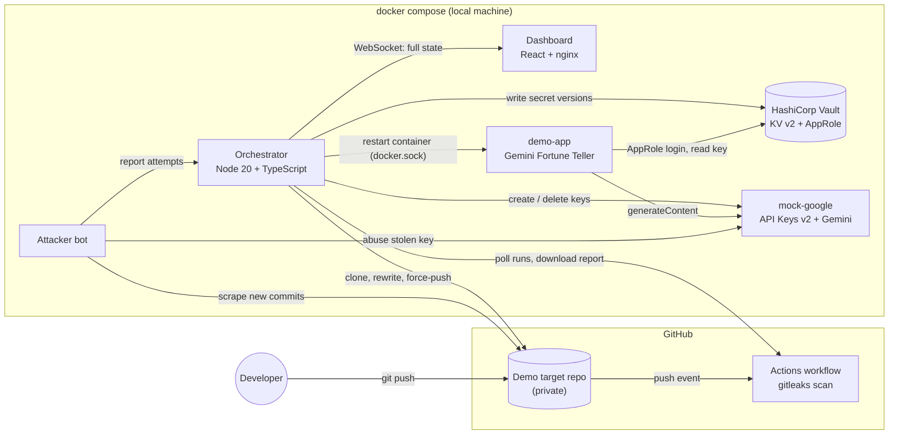
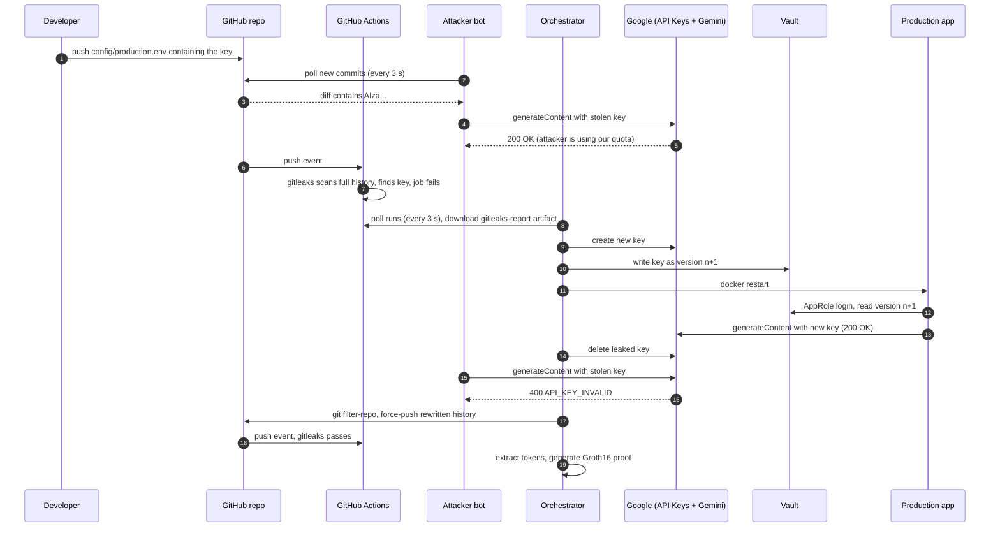

# LeakGuard: Technical Deep Dive

[README](README.md) · **Technical deep dive**

This document explains LeakGuard from first principles: the problem it solves, why the usual fix
does not work, every component and what it does, the exact order of events during an incident, and
the zero-knowledge proof at the end (what it proves, how it is calculated, and why it is needed at all).

---

## Contents

1. [The problem](#1-the-problem)
2. [Why deleting the secret does not help](#2-why-deleting-the-secret-does-not-help)
3. [What LeakGuard does](#3-what-leakguard-does)
4. [Architecture](#4-architecture)
5. [The incident, step by step](#5-the-incident-step-by-step)
6. [Component reference](#6-component-reference)
7. [Why prove anything at all?](#7-why-prove-anything-at-all)
8. [Why a zero-knowledge proof?](#8-why-a-zero-knowledge-proof)
9. [Zero-knowledge proofs from the ground up](#9-zero-knowledge-proofs-from-the-ground-up)
10. [The LeakGuard circuit](#10-the-leakguard-circuit)
11. [How the proof is calculated, end to end](#11-how-the-proof-is-calculated-end-to-end)
12. [What the proof guarantees, and what it does not](#12-what-the-proof-guarantees-and-what-it-does-not)
13. [Security model of LeakGuard itself](#13-security-model-of-leakguard-itself)
14. [How this maps to DevOps and incident response](#14-how-this-maps-to-devops-and-incident-response)
15. [Design decisions and trade-offs](#15-design-decisions-and-trade-offs)
16. [Limitations and future work](#16-limitations-and-future-work)
17. [Questions faculty are likely to ask](#17-questions-faculty-are-likely-to-ask)
18. [Glossary](#18-glossary)

---

## 1. The problem

Modern applications talk to paid third-party services (Google Gemini, OpenAI, AWS, Stripe, databases)
using **API keys**: long random strings that act as both the username and the password. Whoever holds
the string can use the service, and the bill goes to the owner of the key.

Developers keep these keys in configuration files while they work. Sooner or later, one of those files
gets committed and pushed to GitHub. The developer usually means to remove it later. It happens
constantly:

- GitGuardian's *State of Secrets Sprawl 2025* report counted **23.8 million secrets leaked on public
  GitHub in 2024**, a 25% increase over the previous year.
- The same report found that **70% of secrets leaked in 2022 were still valid** when they checked
  again. The leaks are not being cleaned up.
- It also reported that **35% of the private repositories it scanned contained plaintext secrets**.
  A repository being private is not a fix: contractors, forks, CI systems and compromised developer
  accounts all have read access.
- **Toyota (disclosed October 2022):** a subcontractor pushed T-Connect source code to a public GitHub
  repository in December 2017. It contained a hard-coded access key to a customer data server, and
  the key stayed exposed for almost five years. Data for about 296,000 customers was potentially
  reachable.

When a key leaks, the damage depends on **how long the key keeps working** after the leak. Every
second it stays valid is a second someone can use it. The goal is to shrink that window from days or
years to seconds.

## 2. Why deleting the secret does not help

The instinctive fix is to delete the file and push again. That does nothing useful, for four reasons.

**1. Git never forgets.** Git is a content-addressed database: every commit is identified by a hash of
its contents and of its parent. A new commit that deletes the file leaves the old commit untouched,
and anyone can still run `git show <old-sha>` to see the key. The key only leaves git history if the
history itself is rewritten.

**2. Someone has already copied it.** Automated scrapers watch GitHub's public event stream and pull
every new commit within seconds. For private repositories the copy is made by everyone who cloned or
forked, by CI runners, by mirrors and by backup tools. Once the key has been copied, no change to the
repository can take it back.

**3. GitHub keeps old objects around.** Even after history is rewritten and force-pushed, the old
commits can stay reachable on GitHub by their SHA (through cached views, pull-request refs or forks)
until GitHub runs garbage collection. Purging them completely means contacting GitHub support.

**4. The key itself is still valid.** This is the real issue. The only action that truly neutralizes a
leaked key is to **revoke it at the provider**, so the stolen copy becomes worthless. Revoking it
naively breaks production, though, because production is using that same key.

The correct order is therefore:

```
create a new key  ->  move production to it  ->  revoke the old key  ->  then clean history
```

Done by hand, this takes a person, several consoles, a deploy and some git surgery, often under
stress, at night, hours or days after the leak. **LeakGuard automates the entire sequence and finishes
it in under a minute.**

## 3. What LeakGuard does

LeakGuard is an automated incident responder for leaked API keys. It runs as a small set of Docker
containers next to the application it protects and performs eight stages:

| # | Stage | Tool | Purpose |
|---|---|---|---|
| 1 | Leak | git | The secret is pushed. This is the starting event. |
| 2 | Detect | GitHub Actions + gitleaks | Find the secret in CI, with file, line and commit. |
| 3 | Rotate | Google API Keys API + HashiCorp Vault | Mint a new key and store it as a new secret version. |
| 4 | Redeploy | Docker | Restart production so it picks up the new key from Vault. |
| 5 | Revoke | Google API Keys API | Delete the leaked key. Stolen copies stop working. |
| 6 | Clean history | git filter-repo | Remove the key text from every commit and force-push. |
| 7 | Verify | gitleaks (local) + GitHub Actions | Re-scan the rewritten history: it must have zero findings. |
| 8 | Prove | Circom + snarkjs (Groth16) | Produce a zero-knowledge proof that the repo is clean. |

Stages 3 to 5 contain the incident: after them, the key cannot be abused. Stages 6 to 7 remove the
secret from the codebase. Stage 8 lets you show other people that the repository is clean without
showing them the repository.

## 4. Architecture

### 4.1 Containers and external services



| Container | Image / language | Port | Role |
|---|---|---|---|
| `vault` | `hashicorp/vault:1.17` (dev mode) | 8200 | Single source of truth for the production key. |
| `mock-google` | Node 20, no dependencies | 7000 | Same REST paths as Google's API Keys API v2 and Gemini API. |
| `demo-app` | Node 20, no dependencies | 3000 | The "production" app. Reads its key from Vault once at startup. |
| `orchestrator` | Node 20 + TypeScript (tsx), git, git-filter-repo, gitleaks | 4000 | The brain: watches, decides, acts, proves, broadcasts state. |
| `attacker` | Node 20, no dependencies | (5000 internal) | Simulates a credential-scraping bot. |
| `dashboard` | React 18 + Vite, served by nginx | 8080 | The live view. Proxies `/api` and `/ws` to the orchestrator. |

### 4.2 Why these pieces

- **GitHub Actions** is where code arrives, so detection belongs in CI. Every push is scanned, with no
  extra infrastructure.
- **gitleaks** is a widely used open-source secret scanner. It scans the full git history (not just
  the latest files) using a set of rules, including `gcp-api-key` for Google keys
  (`AIza` followed by 35 characters).
- **HashiCorp Vault** decouples the secret from the code. Because the app reads its key from Vault,
  rotating the key means writing a new Vault version and restarting the app. No code change, no
  rebuild.
- **Docker** gives a reproducible environment and a programmable restart. The orchestrator talks to
  the Docker Engine API through the mounted socket.
- **Google API Keys API** is the official way to create and delete Google Cloud API keys
  (which include Gemini / AI Studio keys) programmatically.
- **Circom + snarkjs** are the most widely used open-source toolchain for writing zero-knowledge
  circuits and producing Groth16 proofs, in a JavaScript-friendly form that also runs in the browser.

### 4.3 How state reaches the dashboard

The orchestrator keeps one in-memory object, `FullState` (defined in
`services/orchestrator/src/types.ts`), that describes everything: the incident, the eight steps, Vault
versions, the attacker, the git history, the Actions runs, the app's health, the ZK proof, the logs
and the narration text. Every change calls `changed()`, which pushes the **entire snapshot** over a
WebSocket at most every 80 ms.

The dashboard is therefore a pure function of that snapshot. It never infers anything on its own, so
what the audience sees is always the real state of the system. If the browser reconnects, the next
snapshot repairs the view.

## 5. The incident, step by step

### 5.1 Sequence



### 5.2 What happens at each stage, in detail

The times below come from real runs against GitHub with `DEMO_PACE_MS=0`.

**Stage 1: Leak (about 3 s).** Pressing *Leak a key* makes the orchestrator read the current
production key from Vault and write `config/production.env` containing `GEMINI_API_KEY=<key>` into its
local clone of the target repo. It then commits as "Rahul (intern)" and pushes to `main`. The
exposure clock starts at the moment of the push. The orchestrator also tells the attacker bot to
forget any previous (dead) key.

**The attacker (within about 3 s of the push).** The bot polls the GitHub commits API every 3
seconds. For each new commit it downloads the diff and runs the regex `AIza[\w-]{35}`. On a match it
stores the key and calls the Gemini `generateContent` endpoint with it every 1.2 seconds, reporting
every response to the orchestrator. Requests that return `200` are shown in red: someone else is
spending our quota. The bot never forgets a key it has seen, which is why history cleanup alone
cannot help.

**Stage 2: Detect (about 15 s, mostly GitHub scheduling a runner).** The push triggers the
`LeakGuard secret scan` workflow in the target repo:

1. `actions/checkout@v4` with `fetch-depth: 0`, so the whole history is available.
2. Download the gitleaks v8.21.2 binary.
3. `gitleaks git --redact=0 --report-format json --report-path gitleaks-report.json --exit-code 1 .`
   scans every commit. A finding makes the job fail.
4. `actions/upload-artifact@v4` uploads the JSON report even when the job failed (`if: always()`).

The orchestrator polls the Actions API every 3 seconds. When a run it has not handled finishes with
`conclusion: failure`, it downloads the `gitleaks-report` artifact (a zip), parses the JSON, and gets
the rule ID, file, line, commit, author and the secret itself. It compares the secret with the current
key in Vault. If they match, the key is managed by LeakGuard and the full remediation starts. If not,
rotation is skipped (LeakGuard cannot rotate keys it does not own), but history is still cleaned and
verified.

> Polling was chosen over webhooks so that LeakGuard works on a laptop behind NAT with no public
> URL. A webhook would cut detection latency by about 3 s.

**Stage 3: Rotate (well under 1 s).** The orchestrator calls
`POST /v2/projects/{project}/locations/global/keys` on the API Keys API with an API restriction that
only allows `generativelanguage.googleapis.com`. The API returns a long-running operation, which is
polled until `done`. It then calls `GET {key}/keyString` to read the new key string, and writes
`{ api_key, key_id, created_at, reason }` to Vault at `secret/data/leakguard/gemini`. Vault's KV v2
engine keeps every version, which gives an audit trail: v1 (leaked), v2 (current), and so on.

**Stage 4: Redeploy (about 2 s).** The orchestrator restarts the `leakguard-demo-app` container through
the Docker Engine API. On boot, the app:

1. logs in to Vault with **AppRole** (`role_id` + `secret_id`) and receives a short-lived token
   carrying only the `gemini-read` policy;
2. reads the latest version of the secret;
3. calls Gemini with the new key.

The orchestrator waits until the app's `/health` endpoint reports the new key version **and** a
successful upstream call. Only then does it move on. Users of the app see no outage, because the
old key still works during this window.

**Stage 5: Revoke (milliseconds).** `DELETE /v2/{key_id}` on the API Keys API. From this moment the
attacker's requests return `400 API_KEY_INVALID`, and the dashboard turns the attacker panel green.
The exposure clock freezes and shows how long the key was usable.

> **Rotate, redeploy, then revoke.** Revoking first would take production down. Deploying first
> without revoking would leave the attacker running. This ordering is the core of zero-downtime
> secret rotation.

**Stage 6: Clean history (about 5 s).** In its clone, the orchestrator runs

```
git filter-repo --force --replace-text replacements.txt
```

where `replacements.txt` contains `<leaked key>==>***REMOVED-BY-LEAKGUARD***`. filter-repo rewrites
every blob that contains the key, which changes the commit that introduced it and every commit after
it. Commits before the leak are byte-identical and keep their SHAs. The orchestrator then force-pushes
`main`. The dashboard shows the before and after SHAs side by side.

**Stage 7: Verify (about 12 s).** Two independent checks must pass:

1. **Local:** `gitleaks git` over the rewritten history in the orchestrator container must report
   zero findings.
2. **CI:** the force-push triggers the workflow again. The orchestrator waits for the run on the new
   HEAD to finish with `success` (up to 150 s).

**Stage 8: Prove (1 to 3 s).** The orchestrator extracts every secret-shaped token from every blob
reachable from any ref, then generates a Groth16 zero-knowledge proof that the leaked key is not among
them, bound to the new commit SHA. The proof and its public inputs are published on the dashboard,
where anyone can click **Verify in my browser** to check it locally. Sections 7 to 12 explain this
step in depth.

**Typical totals:** key dead about 17 to 30 s after the push, history clean about 22 s, proof about
35 to 40 s. Most of that is waiting for GitHub's runners. When `DEMO_PACE_MS` is set (default 3000 ms
for presentations), each finished chapter is held on screen a little longer, and the dashboard says
exactly how much of the total was pacing.

### 5.3 Reset

*Reset* force-pushes the commit tagged `baseline` back onto `main`, tells the attacker to forget its
key and clears the incident. The production key in Vault is **not** rolled back: after a run, the
current key is the new one, and the next demo leaks that one. This mirrors reality.

## 6. Component reference

### 6.1 Orchestrator (`services/orchestrator`)

| File | Responsibility |
|---|---|
| `server.ts` | Express HTTP API, WebSocket server, bootstrap with retry. |
| `pipeline.ts` | The state machine: bootstrap, monitors, leak, remediation, proof, reset. |
| `state.ts` | `FullState`, step definitions, plain-English narration, broadcast throttling. |
| `github.ts` | GitHub REST: list runs, download artifacts, read HEAD. |
| `git.ts` | Local clone: leak commit, filter-repo rewrite, reset, gitleaks scan, token extraction. |
| `vault.ts` | Vault bootstrap (AppRole, policy), KV v2 read and write. |
| `google.ts` | API Keys API v2 client (create, read key string, delete) and a Gemini probe. |
| `docker.ts` | Inspect and restart the app container via `/var/run/docker.sock`. |
| `zk.ts` | Token-to-field mapping, Groth16 proving and verification via snarkjs. |

Background loops:

- Actions runs every 3 s.
- App health and Docker status every 2 s.
- Repository HEAD every 10 s (this catches manual pushes from a real developer too).

All git operations run through a single async lock, so a leak, a rewrite and a refresh can never
interleave on the same working copy.

**HTTP API:**

| Method | Path | Purpose |
|---|---|---|
| GET | `/api/state` | Current `FullState`. |
| POST | `/api/leak` | Simulate the leak. |
| POST | `/api/reset` | Restore the baseline. |
| POST | `/api/zk/prove` | Try to prove the repo clean right now (fails while dirty). |
| GET | `/api/zk/proof.json` | Download the proof and public signals. |
| GET | `/api/zk/verification_key.json` | Verification key. |
| POST | `/api/internal/attacker` | Attacker bot reports (internal). |
| WS | `/ws` | Live `FullState` snapshots. |

### 6.2 HashiCorp Vault

- Runs in **dev mode** (in-memory, auto-unsealed, root token from `.env`). This is fine for a demo
  and wrong for production (see section 13).
- **KV v2** secrets engine at `secret/`. The key lives at `secret/data/leakguard/gemini`. Each write
  creates a new version, and old versions remain readable for audit.
- **AppRole** auth: the app authenticates with `role_id = demo-app` and a `secret_id` generated by
  `npm run setup`. The token it receives carries only this policy:

  ```hcl
  path "secret/data/leakguard/gemini" { capabilities = ["read"] }
  ```

  The app can read its one secret and nothing else. It cannot write, list or delete. This is the
  principle of least privilege.

### 6.3 Google: real and simulated

`mock-google` implements the same routes, request bodies and response shapes as:

- `apikeys.googleapis.com/v2`: create key (returns a long-running operation), get key string,
  delete key;
- `generativelanguage.googleapis.com/v1beta/models/{model}:generateContent`: returns a candidate on
  a valid key, and `400 INVALID_ARGUMENT / API_KEY_INVALID` on a deleted or unknown key, exactly like
  Google does.

Generated keys follow Google's real format (`AIza` + 35 URL-safe characters), so gitleaks detects
them with its real `gcp-api-key` rule. With `GOOGLE_MODE=real`, the orchestrator switches base URLs to
Google's hosts and authenticates with a service account (OAuth2 bearer token from
`google-auth-library`). The code path is otherwise identical. In real mode, note that Google can take
a minute or two to propagate a key deletion.

### 6.4 Demo app (`services/demo-app`)

"Gemini Fortune Teller": asks Gemini for a one-line DevOps fortune every 3 seconds. It deliberately
reads its key **once at startup**, like most real apps that load configuration on boot. That makes
the redeploy step necessary and visible.

### 6.5 Attacker bot (`services/attacker`)

Polls `GET /repos/{repo}/commits`, downloads each new commit's diff, extracts Google keys with a
regex and abuses them. It uses the same GitHub token, which simulates anyone with read access: a
contractor, a fork, a compromised laptop, or (for public repositories) every scraper on the internet.

### 6.6 Dashboard (`dashboard`)

A story-driven single page:

- **Left rail:** the eight chapters in order, filling in as the incident progresses, each with its
  real duration.
- **Stage:** only the current chapter, with a plain-English headline, one sentence of explanation
  and one focused visual (the diff, the CI run, the Vault versions, the container, the attacker log,
  before/after commits, verification checks, the proof).
- **Vital signs:** always-visible attacker, production app and repository status.
- **Technical log:** a collapsible drawer with every action LeakGuard took.

Proof verification runs in the browser with `snarkjs.min.js`, so the viewer does not have to trust
the server.

## 7. Why prove anything at all?

After stage 7, LeakGuard *knows* the repository is clean. The problem is that **other people need to
know it too, and they cannot look.**

Consider who cares after a leak:

| Stakeholder | What they need to hear |
|---|---|
| Security team / CISO | The incident is closed and the secret is out of the codebase. |
| External auditor (SOC 2, ISO 27001) | Evidence that the incident response procedure was followed and was effective. |
| Customer or partner whose data the key protected | Assurance that the exposure has ended. |
| Bug-bounty researcher who reported the leak | Confirmation that it was fixed. |
| Management / legal | A record that holds up later. |

The repository is **private**. It contains proprietary source code, other configuration and possibly
other secrets. None of these parties should get read access just to confirm one fact. The usual
answers today are weak:

- **"Trust us, it is fixed."** This is an unverifiable claim.
- **A screenshot of a green scan.** Trivial to fake, and it does not say which commit was scanned.
- **Granting the auditor read access.** This exposes the intellectual property and enlarges the set
  of people who can leak the next secret.
- **A signed report from a scanning tool.** Everyone has to trust the tool vendor and whoever operated
  it, and the report itself proves nothing about the content.

What we actually want is to convince someone of a precise statement, *"the revoked key does not occur
anywhere in commit `X` of this repository"*, while revealing nothing else about the repository. That
is exactly what a zero-knowledge proof does.

## 8. Why a zero-knowledge proof?

A zero-knowledge proof (ZKP) lets a **prover** convince a **verifier** that a statement is true without
revealing *why* it is true. Concretely, it reveals nothing about the secret data (the **witness**)
that makes the statement true.

For LeakGuard:

- **Statement (public):** "There is a set of up to 64 tokens whose Poseidon Merkle commitment, bound
  to commit SHA `X`, equals `C`, and none of those tokens is the leaked key (identified by its hash
  `H`)."
- **Witness (private):** the actual tokens extracted from the repository.
- **Verifier learns:** that the statement is true. Nothing about the tokens, the code or the file
  structure.

A ZKP has three properties:

1. **Completeness:** if the statement is true and the prover is honest, verification succeeds.
2. **Soundness:** if the statement is false, no prover can produce a proof that verifies (except
   with negligible probability). In LeakGuard you can see this directly: press *Try proving clean*
   while the key is still in the repo, and proof generation fails with "Can't prove a lie".
3. **Zero-knowledge:** the proof reveals nothing beyond the truth of the statement. Two proofs for
   two completely different clean repositories look equally random.

Why ZK, and not the alternatives?

| Approach | Verifier learns the code? | Verifier must trust the prover? | Can be checked later by anyone? |
|---|---|---|---|
| Share the repo with the auditor | Yes | No | Only people given access |
| Screenshot / scan log | No | Yes, fully | No |
| Signed attestation from a tool | No | Yes (the tool and its operator) | Yes, but only the signature |
| Publish a hash of the repo | No | Yes, a hash proves nothing about content | Yes |
| **Zero-knowledge proof** | **No** | **No, the math enforces the statement** | **Yes, anyone, forever** |

The ZK proof is also small (a few hundred bytes), quick to verify (milliseconds, even in a browser),
and can be stored next to the incident record as durable evidence.

## 9. Zero-knowledge proofs from the ground up

This section builds up the concepts needed to understand how the LeakGuard proof works.

### 9.1 Everything is arithmetic in a finite field

ZK proof systems cannot run arbitrary code directly. The statement must be written as a system of
equations over a **finite field** `F_p`: the integers modulo a large prime `p`. LeakGuard uses the
**BN254** (also called bn128) elliptic curve, whose scalar field has

```
p = 21888242871839275222246405745257275088548364400416034343698204186575808495617   (about 2^254)
```

Every value in the circuit (every "signal") is a number in `[0, p)`. Addition and multiplication wrap
around modulo `p`.

### 9.2 Circuits and constraints (R1CS)

A **circuit** is written in Circom as a set of **signals** and **constraints**. After compilation,
every constraint has the form of a **Rank-1 Constraint System (R1CS)** row:

```
(a . w) * (b . w) = (c . w)
```

where `w` is the full **witness vector** (the constant 1, the public inputs, the private inputs and
every intermediate signal), and `a`, `b`, `c` are fixed coefficient vectors. Each row allows exactly
one multiplication. A circuit with `m` such rows has `m` constraints. **The LeakGuard circuit has
15,424 constraints** (compiled with `--O2`).

The prover's claim is: "I know a witness `w` that satisfies every row." If any row fails, no valid
proof can exist.

### 9.3 From constraints to polynomials (QAP)

Checking 15,424 equations one by one would reveal the witness and take time proportional to the
circuit. Groth16 converts the R1CS into a **Quadratic Arithmetic Program (QAP)**. Each column of the
`a`, `b` and `c` matrices is interpolated into a polynomial, so that the whole system becomes one
polynomial identity:

```
A(x) * B(x) - C(x) = H(x) * Z(x)
```

`Z(x)` is a fixed polynomial that is zero at every constraint index. The identity holds if and only
if every constraint is satisfied. A polynomial identity can be checked at a single secret random point
`tau`: two different polynomials of degree `d` agree on at most `d` points out of about `2^254`, so a
random evaluation catches any cheating with overwhelming probability.

### 9.4 Hiding the evaluation: elliptic curves and pairings

The prover must not learn `tau`, or it could cheat. The trick is that nobody evaluates at `tau` in
the clear. The evaluation happens "in the exponent" on elliptic-curve groups `G1` and `G2`:
`[tau]G` is a curve point from which `tau` cannot feasibly be recovered (the discrete logarithm
problem). A **bilinear pairing** `e: G1 x G2 -> GT` lets the verifier check multiplicative
relationships between hidden values, because `e([a]G1, [b]G2) = e(G1, G2)^(a*b)`.

### 9.5 The trusted setup

Groth16 needs public parameters derived from secret random values (`tau`, `alpha`, `beta`, `gamma`,
`delta`). If anyone kept those values (the "toxic waste"), they could forge proofs. The setup is
therefore run as a **multi-party ceremony**: each participant mixes in fresh randomness and destroys
it. The result is secure as long as **at least one** participant was honest.

The setup has two phases:

1. **Phase 1, Powers of Tau (universal).** It produces `[tau^i]G1` and `[tau^i]G2` and can be reused
   by any circuit up to a size limit. LeakGuard uses the **PSE perpetual Powers of Tau** ceremony file
   `ppot_0080_15.ptau` (2^15 = 32,768 constraints maximum), produced by a public ceremony with many
   independent contributors.
2. **Phase 2 (circuit-specific).** This step specializes the parameters to our exact circuit and
   produces the **proving key** (`leakguard_final.zkey`, about 8.7 MB) and the **verification key**
   (`verification_key.json`, about 3 KB). For this project, phase 2 has a single contribution made at
   build time with 64 bytes from `/dev/urandom` (see `zk/build.sh`). For production, phase 2 should
   also be a multi-party ceremony.

### 9.6 The proof and its verification

A Groth16 proof is just **three curve points**: `A` in `G1`, `B` in `G2`, `C` in `G1`. That is 128 bytes in
compressed binary form (256 bytes uncompressed) (snarkjs's JSON encoding is larger because it uses decimal
strings).

To verify, the verifier takes the public inputs `x_1 ... x_l`, combines them with the `IC` points from
the verification key, and checks one pairing equation:

```
e(A, B) = e(alpha, beta) * e( IC_0 + x_1*IC_1 + ... + x_l*IC_l , gamma ) * e(C, delta)
```

LeakGuard has 3 public signals, so the verification key contains 4 `IC` points. Verification takes a
few pairings: milliseconds, independent of circuit size. This is why it runs comfortably in the
browser.

**Zero-knowledge** comes from the prover mixing two fresh random values `r` and `s` into `A`, `B` and
`C` for every proof. The points are statistically independent of the witness, so a proof leaks
nothing about it.

## 10. The LeakGuard circuit

Source: [`zk/circuits/leakguard.circom`](zk/circuits/leakguard.circom). Template `LeakGuard(N)` with
`N = 64`.

### 10.1 Inputs and outputs

| Signal | Visibility | Meaning |
|---|---|---|
| `tokens[64]` | **private** | Field encodings of every candidate secret token in the repo, padded with 0. |
| `leakedKeyHash` | public | Field encoding of the leaked (now revoked) key. |
| `commitSha` | public | The git commit SHA the proof refers to, as a field element. |
| `commitment` | public (output) | `Poseidon(MerkleRoot(tokens), commitSha)`. |

snarkjs orders public signals outputs first, so the published array is
`[commitment, leakedKeyHash, commitSha]`.

### 10.2 Constraint block 1: non-inclusion

For each of the 64 tokens:

```circom
eq[i] = IsEqual();
eq[i].in[0] <== tokens[i];
eq[i].in[1] <== leakedKeyHash;
eq[i].out === 0;
```

`IsEqual` comes from circomlib and is built on `IsZero`. To test whether `x = a - b` is zero using
only multiplications, the prover supplies a helper value `inv` (computed outside the circuit as
`1/x` when `x != 0`, otherwise `0`), and the circuit enforces:

```
out = 1 - x * inv
x * out = 0
```

- If `x != 0`: `inv = 1/x`, so `out = 0`, and `x * 0 = 0` holds.
- If `x = 0`: the second equation forces nothing, and the first gives `out = 1` regardless of `inv`.

A cheating prover cannot make `out = 0` when `x = 0` (the first equation would require
`1 - 0 = 0`), and cannot make `out = 1` when `x != 0` (the second would require `x * 1 = 0`).
Requiring `out === 0` for every token is therefore an unforgeable "this token is not the leaked key".

### 10.3 Constraint block 2: the Merkle commitment

The 64 tokens are the leaves of a binary Merkle tree hashed with **Poseidon**:

```
level 0: t0  t1  t2  t3  ...  t62 t63          (64 leaves)
level 1: P(t0,t1)  P(t2,t3)  ...  P(t62,t63)    (32 nodes)
...
level 6: root                                   (1 node, 63 Poseidon hashes in total)
commitment = P(root, commitSha)
```

The commitment pins down the *exact* set of hidden tokens. Changing, adding or removing any token
changes the root, so the prover cannot later claim the proof was about a different set. Binding it to
`commitSha` ties the proof to one specific snapshot of the repository.

### 10.4 Why Poseidon and not SHA-256?

Inside a circuit, cost is measured in constraints. SHA-256 is built from bit operations (XOR,
rotations), and each bit becomes a separate field element, so one SHA-256 compression costs roughly
**27,000 to 30,000 constraints**. Poseidon is designed for prime fields: it uses field additions,
multiplications and the S-box `x^5`, and a 2-input Poseidon costs about **240 constraints**. The 64
Poseidon hashes in this circuit account for almost all of its 15,424 constraints. The same tree built
with SHA-256 would need around 1.9 million constraints, which is too large for a demo laptop.

### 10.5 Mapping strings to field elements

Tokens are text, but circuit signals are field elements. Outside the circuit, LeakGuard maps every
token (and the leaked key) with:

```
tokenToField(s) = SHA-256(utf8(s)) >> 8      (the top 248 bits)
```

248 bits always fit below `p` (about 2^254), so the mapping never wraps around. Two different tokens
collide only if SHA-256 collides on its top 248 bits, which is computationally infeasible. The
leaked key's encoding `leakedKeyHash` is published. That is safe because the key is already revoked,
and SHA-256 is one-way anyway.

The commit SHA (160-bit SHA-1 hex) is converted directly: `commitSha = BigInt('0x' + sha)`.

## 11. How the proof is calculated, end to end

This is the exact pipeline the orchestrator runs (see `git.ts:candidateTokens` and `zk.ts:proveClean`).

**Step 1: Snapshot.** Sync the local clone to `origin/main` and record `HEAD`
(for example `dc791adeeb33529bb8911789bd97ce3ecad39f43`).

**Step 2: Extract candidate tokens.** List every blob reachable from any ref:

```
git rev-list --objects --all --filter=object:type=blob
```

For each blob, find every match of `[A-Za-z0-9_-]{20,}`, meaning every long run of characters that
*could* be a secret. Google keys (39 characters), most API tokens, JWT segments and hex digests all
match. Duplicates are removed. Because it scans every reachable blob and not just the latest files,
a key hiding in an older commit is still caught.

**Step 3: Pre-check.** Encode the leaked key and every token with `tokenToField`. If any token
equals the leaked key, stop with `DirtyRepoError`: an honest prover knows immediately that no proof
exists. Even if this check were skipped, witness generation would fail on `eq.out === 0`.

**Step 4: Build the input.** Pad the token list to 64 entries with zeros:

```json
{
  "tokens": ["31474...", "0", "0", "... 64 values in total ..."],
  "leakedKeyHash": "165297898875938966432620611412609552615849742768719762237067388360830475126",
  "commitSha": "1258678700525021644590483018812759165352866455363"
}
```

**Step 5: Witness generation.** snarkjs loads `leakguard.wasm` (the circuit compiled to
WebAssembly) and computes every intermediate signal: 64 `IsEqual` results, 63 Merkle nodes and the
final commitment. Every R1CS constraint is checked during this step.

**Step 6: Proving.** `groth16.fullProve` combines the witness with the proving key
(`leakguard_final.zkey`): multi-scalar multiplications on BN254 and polynomial arithmetic (FFTs) to
compute `H(x)`, plus fresh randomness `r`, `s`. Output: `proof = { pi_a, pi_b, pi_c }` and
`publicSignals = [commitment, leakedKeyHash, commitSha]`. This takes about 1 to 3 seconds on a
laptop.

**Step 7: Publish.** The dashboard shows the public signals and offers `proof.json` for download.

**Step 8: Verify (anyone).** Either click *Verify in my browser* (snarkjs in the page, using
`verification_key.json`), or run:

```bash
npx snarkjs groth16 verify zk/build/verification_key.json public.json proof.json
```

Verification answers one question: does the pairing equation hold for these three points and these
public signals? If yes, the verifier knows that someone held 64 tokens committing to `commitment` at
`commitSha` and that none of them encodes the leaked key, without learning the tokens.

## 12. What the proof guarantees, and what it does not

It is important to state the claim precisely. Overclaiming is a security bug.

**The proof guarantees:**

- The prover knew a set of at most 64 tokens whose Poseidon Merkle commitment, bound to
  `commitSha`, equals the public `commitment`.
- None of those tokens encodes to `leakedKeyHash`.
- Nothing else about the tokens is revealed.

**The proof does not, by itself, guarantee:**

- **That the hidden tokens really are all the tokens of that commit.** Token extraction happens
  outside the circuit. The binding is through the commitment: anyone who later gets read access (an
  auditor in a dispute, or the owner during an investigation) can re-run the extraction at
  `commitSha`, recompute the commitment, and check it matches. A prover who left tokens out would be
  caught at that point. This is a *commit now, open on dispute* model.
- **That the key is not somewhere other than this repository** (another repo, a laptop, a log file).
- **That nobody copied the key before it was revoked.** That is exactly why LeakGuard rotates and
  revokes first: the proof is about the codebase, and rotation is about the key.
- **That GitHub has purged orphaned commits.** The proof covers objects reachable from refs.

How to close the first gap (future work, section 16): hash the raw file contents inside the circuit
and recompute the git tree hash, or run the scanner itself inside a zkVM (for example RISC Zero or
SP1) and prove its execution. Both remove the need to trust the extraction step, at a much higher
proving cost.

## 13. Security model of LeakGuard itself

LeakGuard holds powerful credentials, so it must be treated as sensitive infrastructure.

| Asset | Where | Risk if stolen | Production recommendation |
|---|---|---|---|
| GitHub token (`repo` scope) | `.env`, orchestrator, attacker | Read and force-push to repos | A GitHub App with per-repo installation and minimal permissions |
| Vault root token | `.env`, orchestrator | Full Vault control | Vault server mode, auto-unseal, scoped orchestrator policy |
| Docker socket | Orchestrator container | Root-equivalent on the host | Deploy through an orchestrator API (Kubernetes rollout) instead |
| Google service account | `secrets/gcp-sa.json` | Create and delete API keys | Workload identity, API Keys Admin role only on one project |

Other notes:

- Secrets are **masked** (`AIza...wqi2`) everywhere in logs and on the dashboard. The full key exists
  only in Vault, in memory during remediation, and in the attacker simulation.
- The repo's own CI runs gitleaks on LeakGuard's history (it practices what it preaches), and no test
  fixture contains a literal key.
- Force-pushing rewrites shared history. Real teams must re-clone or rebase afterwards. LeakGuard
  should be allowed to force-push only on protected branches it is configured for.
- Vault dev mode keeps data in memory. After `docker compose down`, Vault starts empty and LeakGuard
  provisions a fresh key on boot.

## 14. How this maps to DevOps and incident response

**NIST SP 800-61 incident response lifecycle:**

| NIST phase | LeakGuard |
|---|---|
| Preparation | Secrets in Vault, AppRole, CI scanning on every push, baseline tag |
| Detection and Analysis | GitHub Actions + gitleaks, artifact parsing, managed-secret check |
| Containment | Rotate, redeploy, revoke (the stolen key stops working) |
| Eradication and Recovery | filter-repo rewrite, force-push, re-scan, healthy production |
| Post-Incident Activity | Timeline, per-step durations, Vault version history, ZK proof as evidence |

**DevOps practices demonstrated:**

- **CI/CD:** security scanning as a pipeline gate on every push (shift-left detection).
- **Secrets management:** no secret in code, centralized versioned storage, least-privilege machine
  identity.
- **Immutable, reproducible infrastructure:** the whole system starts with one `docker compose up`.
- **Automation of operations:** a runbook that would take a human hours runs as code in seconds.
- **Observability:** a live state stream, a timeline and per-step metrics (time to detect, time to
  contain, time to recover).
- **Zero-downtime deployment:** the new key is live before the old one dies.

The headline metric is **MTTR** (mean time to remediate). Manual response to a leaked key is measured
in hours or days, and often never happens (70% still valid two years later). LeakGuard brings the
time the key is usable after the push down to well under a minute.

## 15. Design decisions and trade-offs

| Decision | Alternative | Why |
|---|---|---|
| Poll the Actions API every 3 s | GitHub webhook | Works behind NAT with no public URL. Costs about 3 s of latency. |
| Scan in CI, act in the orchestrator | Do everything in Actions | Rotation needs Vault, Docker and Google credentials that should not live in the target repo's CI. |
| Rotate, redeploy, then revoke | Revoke first | Zero downtime for real users. |
| `git filter-repo` | BFG, `filter-branch` | Officially recommended by git, fast, and keeps unchanged commits byte-identical. |
| Push workflow files over SSH in setup | HTTPS with token | GitHub requires the `workflow` scope for workflow files over HTTPS. Rewrites never touch the workflow commit, so the orchestrator needs only `repo`. |
| Full-state snapshots over WebSocket | Event deltas | The UI can never drift from reality, and reconnects heal automatically. |
| Groth16 | PLONK, STARKs | Smallest proofs and fastest verification. Needs a trusted setup, mitigated by the public phase 1 ceremony. |
| Poseidon Merkle tree | SHA-256 in circuit | About 120x fewer constraints. |
| N = 64 tokens | Larger N | Fits a 2^15 Powers of Tau and proves in seconds. Bigger repos need a larger N or chunked proofs. |
| Mock Google with identical routes | Only real Google | Anyone can run the demo without a billing account. Real mode is a configuration switch. |
| Presentation pacing (`DEMO_PACE_MS`) | None | An audience can follow each chapter. The amount is reported, never hidden in the numbers. |

## 16. Limitations and future work

- **Token capacity:** 64 unique candidate tokens. Larger repositories need a bigger circuit (and
  Powers of Tau file), or multiple proofs aggregated with recursion.
- **Extraction trust:** see section 12. Move hashing of file contents into the circuit, or prove the
  scanner's execution in a zkVM.
- **Only Google API keys are rotated.** The design is provider-agnostic (detect, mint, store, deploy,
  revoke). Adding AWS IAM keys, GitHub tokens or database passwords means adding a provider module.
- **Single app, single key.** Real systems need a mapping from secret to the set of services using it,
  with rolling restarts.
- **Orphaned commits on GitHub** still need a support request to purge.
- **Production hardening:** Vault server mode with persistent storage, a GitHub App instead of a
  personal token, no Docker socket, and a multi-party phase 2 ceremony.
- **Notification:** post incident summaries (with the proof attached) to Slack or email, and open a
  ticket automatically.

## 17. Questions faculty are likely to ask

**Q: GitHub already has push protection. Why build this?**
Push protection blocks a push *before* it lands, but it can be bypassed, it is not available on every
private repo plan, and it does nothing for secrets already in history or pushed from elsewhere.
LeakGuard handles the after-the-fact case, which is the one that causes breaches.

**Q: Why not just delete the file?**
Git keeps the old commit, the key was already copied within seconds, and the key itself is still
valid. Only revocation neutralizes it (section 2).

**Q: Is the attacker real?**
The attacker is a real program that really reads commits from GitHub and really calls the
(simulated) Gemini API. In public repositories, bots that do exactly this exist and operate within
seconds.

**Q: Why is the zero-knowledge proof needed if gitleaks already says the repo is clean?**
gitleaks convinces *us*. The proof convinces *someone else* who cannot see the private repository
and does not want to trust our word or our tools (section 7).

**Q: What exactly does the verifier learn?**
Three numbers: a commitment to the hidden tokens, the hash of the revoked key and the commit SHA.
Plus one bit: whether the statement is true.

**Q: Could LeakGuard fake a proof while the key is still there?**
Not for the committed token set. `IsEqual(...).out === 0` makes the constraint system unsatisfiable,
and you can watch it fail with *Try proving clean*. What a dishonest operator *could* do is omit the
key's token from the committed set. That omission would be exposed as soon as anyone recomputes the
commitment from the real repo (section 12).

**Q: What is the trusted setup, and should we worry?**
Groth16 needs parameters made from secrets that must be destroyed. Phase 1 comes from a public
multi-party ceremony (secure if any one contributor was honest). Phase 2 here has one contribution,
which is acceptable for a demo. Production should run a ceremony or use a transparent proof system
such as a STARK.

**Q: How long does proving take, and how big is the proof?**
About 1 to 3 seconds for 15,424 constraints. The proof is 3 elliptic-curve points (128 bytes
compressed). Verification takes milliseconds.

**Q: Why Vault and not GitHub Secrets or environment variables?**
GitHub Secrets is for CI, not for running applications. Environment variables baked into an image
cannot be rotated without a rebuild. Vault gives versioning, audit, fine-grained policies and
machine authentication (AppRole).

**Q: Does it work with real Google keys?**
Yes. Set `GOOGLE_MODE=real` with a service account that has the API Keys Admin role (README). The
same code path talks to `apikeys.googleapis.com` and `generativelanguage.googleapis.com`.

## 18. Glossary

| Term | Meaning |
|---|---|
| API key | A secret string that authenticates calls to a paid API. |
| AppRole | A Vault auth method for machines, using a role ID and a secret ID. |
| Artifact | A file uploaded by a GitHub Actions run (here, the gitleaks JSON report). |
| BN254 / bn128 | The pairing-friendly elliptic curve used by Groth16 in snarkjs. |
| Circom | A language for writing arithmetic circuits for ZK proofs. |
| Commitment | A value that binds to hidden data without revealing it (here, a Poseidon Merkle root). |
| Constraint | One equation the witness must satisfy (one R1CS row). |
| filter-repo | A git tool that rewrites history, for example to replace text in every commit. |
| gitleaks | An open-source scanner that finds secrets in git history. |
| Groth16 | A zk-SNARK proof system with constant-size proofs and fast verification. |
| KV v2 | Vault's versioned key/value secrets engine. |
| Merkle tree | A tree of hashes whose root commits to all of its leaves. |
| MTTR | Mean time to remediate: how long until an incident is resolved. |
| Pairing | A bilinear map between curve groups used to check proofs. |
| Poseidon | A hash function designed to be cheap inside ZK circuits. |
| Powers of Tau | The universal first phase of a Groth16 trusted setup. |
| R1CS | Rank-1 Constraint System: the compiled form of a circuit. |
| Rotation | Replacing a secret with a new one and retiring the old one. |
| snarkjs | A JavaScript library to set up, prove and verify Groth16 / PLONK proofs. |
| Soundness | A false statement cannot be proven. |
| Witness | The full private assignment of values that satisfies the circuit. |
| Zero-knowledge | A proof reveals nothing beyond the truth of the statement. |

---

### References

- GitGuardian, *The State of Secrets Sprawl 2025*: https://blog.gitguardian.com/the-state-of-secrets-sprawl-2025/
- Help Net Security summary of the 2025 report: https://www.helpnetsecurity.com/2025/03/19/report-the-state-of-secrets-sprawl-2025/
- GitGuardian on the Toyota T-Connect key exposure: https://blog.gitguardian.com/toyota-accidently-exposed-a-secret-key-publicly-on-github-for-five-years/
- NIST SP 800-61 Rev. 2, *Computer Security Incident Handling Guide*.
- Jens Groth, *On the Size of Pairing-based Non-interactive Arguments* (EUROCRYPT 2016).
- Grassi et al., *Poseidon: A New Hash Function for Zero-Knowledge Proof Systems* (USENIX Security 2021).
- Circom and snarkjs documentation: https://docs.circom.io
- HashiCorp Vault KV v2 and AppRole documentation: https://developer.hashicorp.com/vault/docs
- Google API Keys API: https://cloud.google.com/api-keys/docs
- gitleaks: https://github.com/gitleaks/gitleaks
- git filter-repo: https://github.com/newren/git-filter-repo
